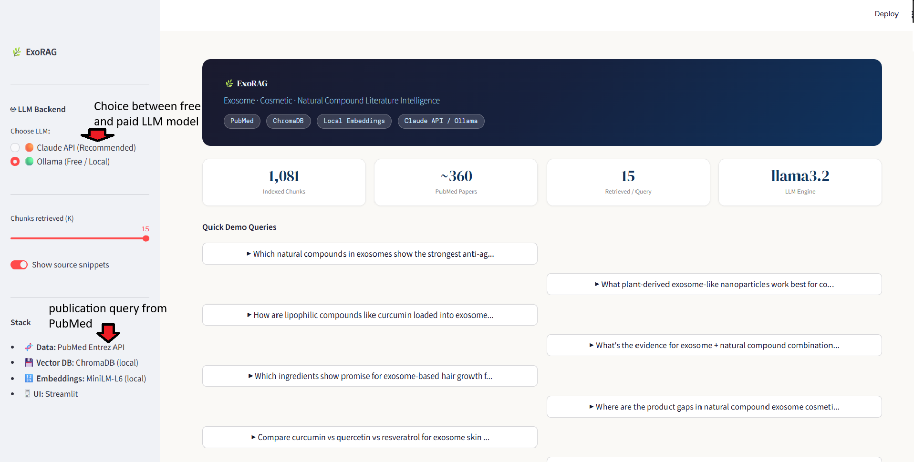

# ExoRAG — Exosome · Cosmetic · Natural Compound Intelligence
### A fully local RAG pipeline using PubMed + ChromaDB + Claude AI

---

## What This Is

ExoRAG mines PubMed literature on exosomes, cosmetic applications, natural compounds,
regenerative medicine, and cell therapy biologics — then lets you ask product development
questions in plain English. Every answer is grounded in real papers with clickable PubMed citations.

Built as an internal R&D intelligence tool for exosome-based cosmetic and therapeutic product development.

## Screenshots

### App Homepage


### Query Results


**Architecture:**
```
PubMed (free API) → abstracts.json → ChromaDB (local) ← sentence-transformers (local)
                                           ↓
                              Query → embed → similarity search
                                           ↓
                              Context + Prompt → Claude API → Answer
```

**Cost:**
| Component       | Cost         |
|----------------|--------------|
| PubMed fetch    | Free         |
| ChromaDB        | Free (local) |
| Embeddings      | Free (local) |
| Claude LLM      | ~$0.01/query |

---

## Project Structure

```
exorag/
├── README.md                  ← You are here
├── requirements.txt           ← Python dependencies
├── .env.example               ← Config template (copy to .env)
│
├── scripts/
│   ├── 01_fetch_pubmed.py     ← Pull abstracts from PubMed (28 targeted queries)
│   ├── 02_build_index.py      ← Embed + store in ChromaDB (local)
│   ├── 03_query_cli.py        ← CLI query interface (testing)
│   ├── 04_app.py              ← Streamlit demo app (main UI)
│   └── 05_explorer.py         ← Corpus analytics
│
├── data/
│   └── abstracts.json         ← Generated by script 01 (~2,000–3,000 papers)
│
├── chroma_db/                 ← Generated by script 02 (local vector store)
│   └── ...                    ← Auto-created, do not edit manually
│
└── outputs/
    ├── query_log.json         ← Query history
    ├── compound_stats.json    ← Compound analytics
    └── report.txt             ← Human-readable corpus report
```

---

## Knowledge Base — What You Can Search

ExoRAG indexes **28 targeted PubMed queries** across two sections.
After deduplication, the knowledge base contains approximately **2,000–3,000 unique abstracts**.

---

### Section 1 — Core Exosome, Cosmetic & Natural Compound Literature (14 queries)

| Category | Key Terms Covered |
|---|---|
| Exosome + skin / cosmetic / wound | anti-aging, skincare, dermatology, wound healing |
| Exosome + collagen / matrix proteins | collagen, elastin, hyaluronic acid, fibroblast |
| Exosome + hair & scalp | alopecia, hair growth, scalp |
| Natural compounds + exosome (general) | phytochemical, plant extract, herbal, bioactive |
| Curcumin + exosome / nanoparticle | curcumin delivery, encapsulation |
| Quercetin, resveratrol, EGCG, berberine + exosome | polyphenols, green tea, luteolin |
| Ginger, turmeric + exosome | zingiber, gingerol, shogaol, curcuma |
| Plant-derived exosome-like nanoparticles (ELNs) | plant-derived EV, PELN |
| Fruit & vegetable ELNs | grape, aloe vera, blueberry, garlic, carrot, lemon, tomato |
| Exosome drug loading & formulation | cargo loading, electroporation, sonication, encapsulation |
| Topical / transdermal exosome delivery | skin penetration, percutaneous, transdermal |
| Anti-inflammatory & antioxidant + natural compounds | plant-based, botanical anti-inflammatory |
| Cosmetic actives + exosome | retinol, vitamin C, niacinamide, ceramide, peptide, hyaluronic acid |
| Melanin / pigmentation | skin brightening, whitening, melanocyte |

---

### Section 2 — Invitrx-Specific Product & Technology Literature (14 queries)

#### Reluma PEM Technology
| Category | Key Terms Covered |
|---|---|
| Polypeptide Enriched Media (PEM) + skin | growth factor, matrix protein, peptide complex, fibroblast, keratinocyte |
| Conditioned medium / secretome + cosmetic | cell-conditioned media, paracrine signaling, wound healing |
| Stem cell secretome + skin rejuvenation | stem cell paracrine, conditioned medium, anti-aging |

#### Invitra HCT/P Biologics Product Lines
| Category | Key Terms Covered |
|---|---|
| Wharton's Jelly MSC exosome | WJ-MSC, umbilical cord MSC, regenerative, anti-inflammatory |
| Umbilical cord MSC tissue repair | UC-MSC, tissue repair, wound healing |
| Cord blood plasma (hUCBP) + skin | umbilical cord blood plasma, growth factor, cosmetic |
| Cord blood exosome therapeutics | cord blood EV, regenerative, anti-inflammatory |
| Amniotic fluid / membrane + exosome | amnion, amniotic EV, skin, wound, cosmetic |
| Amniotic membrane wound & burn healing | tissue repair, burn, diabetic ulcer, anti-inflammatory |

#### Clinical Indications (Invitrx Founding Applications)
| Category | Key Terms Covered |
|---|---|
| Cell therapy for burns & diabetic ulcers | skin graft, chronic wound, burn, cell therapy |
| Exosome ocular / ophthalmic applications | cornea, dry eye, ocular surface disorder |
| Cell therapy in plastic & reconstructive surgery | fat grafting, scar, keloid, reconstructive |

#### EV Characterization (Flow Cytometry + ELISA Training Context)
| Category | Key Terms Covered |
|---|---|
| Exosome flow cytometry & NTA characterization | CD9, CD63, CD81, tetraspanin, nanoparticle tracking |
| Exosome ELISA cytokine quantification | TGF-beta, VEGF, EGF, IGF, FGF, skin/wound |
| Exosome miRNA / small RNA cargo profiling | miRNA, ncRNA, RNA cargo, fibroblast, keratinocyte |
| Exosome proteomics & cargo profiling | mass spectrometry, protein cargo, stem cell |

#### GMP Manufacturing & Regulatory
| Category | Key Terms Covered |
|---|---|
| Exosome GMP isolation & scale-up | ultracentrifugation, size exclusion, clinical grade, manufacturing |
| Exosome stability, storage & lyophilization | freeze-drying, shelf life, formulation |
| HCT/P FDA regulatory & QC | 21 CFR 1271, tissue bank, lot release, quality control |
| Exosome cosmetic clinical safety | toxicity, adverse effect, clinical trial, topical |

#### Emerging Therapeutics (Invitrx Asia Summit 2025–2026 Focus)
| Category | Key Terms Covered |
|---|---|
| Exosome cancer immunotherapy delivery | tumor, checkpoint, engineered EV, drug delivery |
| Engineered exosome surface modification | functionalized, targeted delivery, gene engineering |
| Exosome longevity, senescence & aging biology | healthspan, rejuvenation, senescence, longevity |
| Stem cell QC, viability & potency assays (GMP) | lot release, sterility, cell viability, potency |

---

## Example Questions You Can Ask

**Product development:**
- *"Which natural compounds loaded into exosomes show the strongest anti-aging skin evidence?"*
- *"What plant-derived ELNs from fruits or vegetables are most studied for cosmetic delivery?"*
- *"How does curcumin get encapsulated into exosomes and what are the loading efficiency trade-offs?"*

**Invitrx product lines:**
- *"What growth factors are secreted by Wharton's jelly MSCs and how do they promote skin repair?"*
- *"What does the literature say about amniotic fluid exosomes for wound healing?"*
- *"How does cord blood plasma compare to PRP for skin regeneration?"*

**EV characterization:**
- *"What are the standard surface markers for validating exosome identity by flow cytometry?"*
- *"Which miRNAs in MSC-derived exosomes are most associated with skin regeneration?"*
- *"How do you validate exosome cargo integrity for GMP manufacturing?"*

**Regulatory & safety:**
- *"What safety evidence exists for topically applied exosomes in cosmetics?"*
- *"What are the FDA regulatory requirements for HCT/P exosome products?"*

**Competitive landscape:**
- *"What are the research gaps in plant-derived exosome cosmetics — where is the evidence weakest?"*
- *"Which journals are publishing the most exosome cosmetic research and who are the key groups?"*

---

## Prerequisites

- Python 3.10 or higher
- **An LLM — you must set up one of these before the app will work:**
  - **Option A — Claude API** *(recommended, best quality)*: Create an account at https://console.anthropic.com → API Keys → Create Key. Add it to `.env` as `ANTHROPIC_API_KEY=sk-ant-...`
  - **Option B — Ollama** *(100% free, no account needed)*: Download from https://ollama.com, run `ollama pull llama3.2`, then `ollama serve`. The app auto-detects it.
- ~1GB disk space (ChromaDB + embedding model)
- Internet connection (for PubMed fetch and Claude API only — everything else is local)

---

## Step-by-Step Setup

### Step 0 — Clone / download and set up Python environment

```bash
cd exorag
python -m venv venv

# Mac / Linux:
source venv/bin/activate

# Windows (run this first if needed):
# Set-ExecutionPolicy -ExecutionPolicy RemoteSigned -Scope CurrentUser
venv\Scripts\activate

pip install -r requirements.txt
```

**Mac Apple Silicon (M1/M2/M3):**
```bash
pip install chromadb --no-binary chromadb
```

---

### Step 1 — Configure your API key

```bash
cp .env.example .env
# Edit .env → add ANTHROPIC_API_KEY=sk-ant-... and your ENTREZ_EMAIL
```

---

### Step 2 — Fetch PubMed literature

```bash
python scripts/01_fetch_pubmed.py
```

Runs 28 targeted queries. Saves ~2,000–3,000 deduplicated abstracts to `data/abstracts.json`.
**Runtime:** 10–20 minutes. **Cost: Free.**

---

### Step 3 — Build the local vector index

```bash
python scripts/02_build_index.py
```

Downloads the embedding model (~80MB, first run only), embeds all chunks, stores in `chroma_db/`.
**Runtime:** 20–35 minutes on CPU (one-time). **Cost: Free.**

---

### Step 4 — Test with CLI (optional)

```bash
python scripts/03_query_cli.py
```

---

### Step 5 — Launch the app

```bash
streamlit run scripts/04_app.py
```

Opens at **http://localhost:8501**

---

### Step 6 — Run corpus analytics (optional)

```bash
python scripts/05_explorer.py
```

Outputs compound frequency, publication trends, top journals, and delivery route analysis to `outputs/report.txt`.

---

## Changing the Claude Model

```bash
# Fastest, cheapest (~$0.001/query)
CLAUDE_MODEL=claude-3-5-haiku-20241022

# Smarter, better answers (~$0.01/query)
CLAUDE_MODEL=claude-3-5-sonnet-20241022
```

---

## Troubleshooting

| Error | Fix |
|---|---|
| `chroma_db not found` | Run `02_build_index.py` first |
| `abstracts.json not found` | Run `01_fetch_pubmed.py` first |
| `ANTHROPIC_API_KEY not set` | Copy `.env.example` → `.env` and add your key |
| Slow first embedding run | Normal — model downloads ~80MB once, then instant |
| ChromaDB error on Mac M1/M2 | `pip install chromadb --no-binary chromadb` |
| Port 8501 in use | `streamlit run scripts/04_app.py --server.port 8502` |

---

## Interview Talking Points

1. **Fully local** — ChromaDB and embeddings run on your laptop; no data leaves your machine except the Claude API call
2. **Domain-specific** — 28 queries tuned to exosome cosmetics, regenerative biologics, and cell therapy manufacturing; not a generic literature bot
3. **Covers the full product stack** — from PEM/secretome science (Reluma) to Wharton's jelly and amniotic EV biology (Invitra) to GMP manufacturing QC
4. **Every answer is cited** — LLM synthesizes retrieved text with visible PMID sources; no hallucinated compounds
5. **Scalable** — same pipeline indexes internal formulation documents, lab notebooks, or patents alongside PubMed
6. **Prior validation** — same architecture built for GBM radioresistance literature at USC; proven pattern applied to a new domain
7. **Stays current** — schedule `01_fetch_pubmed.py` monthly to pull new literature automatically
